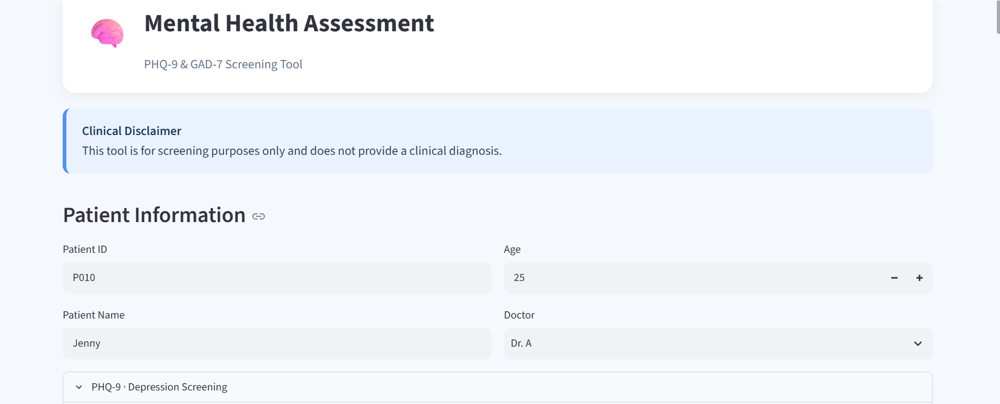
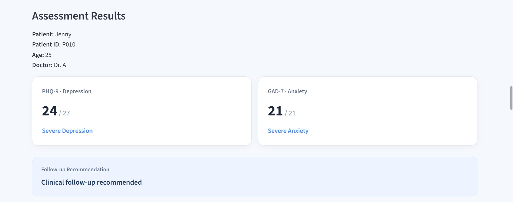
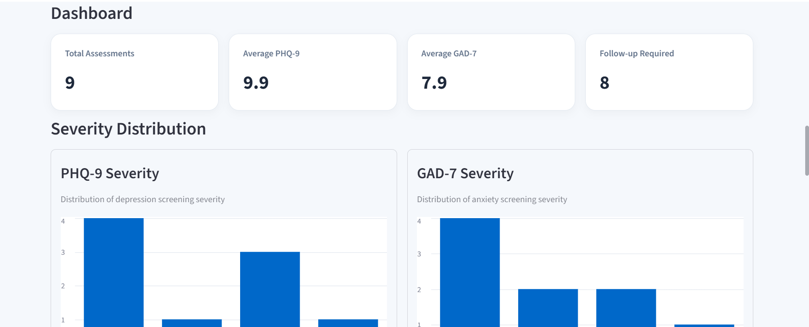

# Mental Health Assessment MVP

A Streamlit-based mental health screening application integrating PHQ-9 and GAD-7 assessments with patient record management, follow-up recommendations, and basic clinical screening analytics.

## Overview

This project is an educational prototype designed to demonstrate how standardized mental health screening questionnaires can be integrated into a simple digital health workflow.

The application allows users to complete PHQ-9 and GAD-7 assessments, calculates and classifies screening scores, flags positive responses to PHQ-9 Item 9, generates follow-up recommendations, and stores assessment records in a local SQLite database.

A Streamlit dashboard provides basic assessment analytics and allows stored assessment records to be viewed, filtered, updated, and deleted.

The application is intended to support screening workflows only. It does not provide diagnoses or replace clinical judgment.

---

## Related Projects

- [PHQ-9 Assessment Engine](https://github.com/knurulshf/phq9-assessment-engine)
- [GAD-7 Assessment Engine](https://github.com/knurulshf/gad7-assessment-engine)

---

## Features

* Interactive PHQ-9 and GAD-7 screening questionnaires
* Automatic score calculation and severity classification
* PHQ-9 Item 9 safety flag for additional clinical assessment
* Rule-based follow-up recommendations
* Structured clinical screening summary
* Patient and assessment information input
* Local assessment storage using SQLite
* Assessment history and record management
* Update and delete functionality for stored assessments
* Doctor-based record filtering
* Dashboard metrics for average PHQ-9 and GAD-7 scores
* PHQ-9 and GAD-7 severity distribution charts
* Input validation for screening responses and patient information
* Modular Python structure separating assessment, database, and follow-up logic

---

## Project Structure

```text
patient-summary-generator/
│
├── app.py          # Main Streamlit application
├── phq9.py         # PHQ-9 scoring, validation, and severity classification
├── gad7.py         # GAD-7 scoring, validation, and severity classification
├── followup.py     # Rule-based follow-up recommendation logic
├── database.py     # SQLite database operations
├── cli_demo.py     # Earlier command-line demonstration
├── README.md       # Project documentation
├── LICENSE
└── .gitignore

---

## Current Application

The Streamlit application provides an interactive workflow for mental health screening and assessment management.

The current MVP includes:

1. Patient information entry
2. PHQ-9 depression screening
3. GAD-7 anxiety screening
4. Automated scoring and severity classification
5. PHQ-9 Item 9 safety flag
6. Rule-based follow-up recommendation
7. Clinical screening summary
8. SQLite assessment storage
9. Assessment record management
10. Dashboard metrics and severity distributions
## Application Screenshots

### Screening Interface

The application collects patient information and provides interactive PHQ-9 and GAD-7 screening questionnaires.



### Assessment Results

Screening results display PHQ-9 and GAD-7 scores, severity classifications, and a rule-based follow-up recommendation.



### Dashboard

The dashboard summarizes assessment records using aggregate metrics and PHQ-9 and GAD-7 severity distributions.



*All patient information and assessment records shown in these screenshots are synthetic and used for demonstration purposes only.*

---

## Requirements

- Python 3.10 or later
- Streamlit
- pandas

The application also uses Python's built-in `sqlite3` module for local database storage.

---

## How to Run

Clone the repository:

```bash
git clone https://github.com/knurulshf/patient-summary-generator.git
```

Navigate to the project directory:

```bash
cd patient-summary-generator
```

Install the required dependencies:

```bash
pip install -r requirements.txt
```

Run the Streamlit application:

```bash
streamlit run app.py
```

The application will open in your web browser.

### Command-Line Demo

An earlier command-line version of the project is also included:

```bash
python cli_demo.py
```

---

## What I Learned

Building this project helped me develop practical experience with:

* Structuring a Python project using multiple modules
* Integrating PHQ-9 and GAD-7 screening logic into one application
* Building an interactive web application with Streamlit
* Using pandas to organize and analyze assessment records
* Creating and managing a local SQLite database
* Implementing create, read, update, and delete (CRUD) operations
* Designing rule-based follow-up logic
* Validating user input and handling screening data
* Building simple dashboard metrics and data visualizations
* Testing and debugging an application across multiple modules
* Using Git and GitHub for version control and project documentation

---

## Disclaimer

This project is intended for educational purposes only.

It is **not** a diagnostic tool and should **not** replace clinical judgment or professional medical assessment.

---

## Future Improvements

Potential future development includes:

* Separate patient and clinician interfaces
* User authentication and role-based access control
* Improved privacy and security for health information
* Migration from local SQLite storage to a production-ready database
* Expanded clinical dashboard and longitudinal assessment tracking
* Deployment of the application for demonstration purposes
* AI-assisted summarization of patient-reported information
* Additional validated mental health screening instruments
* Further usability and accessibility improvements

---

## Author

**Khansa Nurul Shafiyah**
